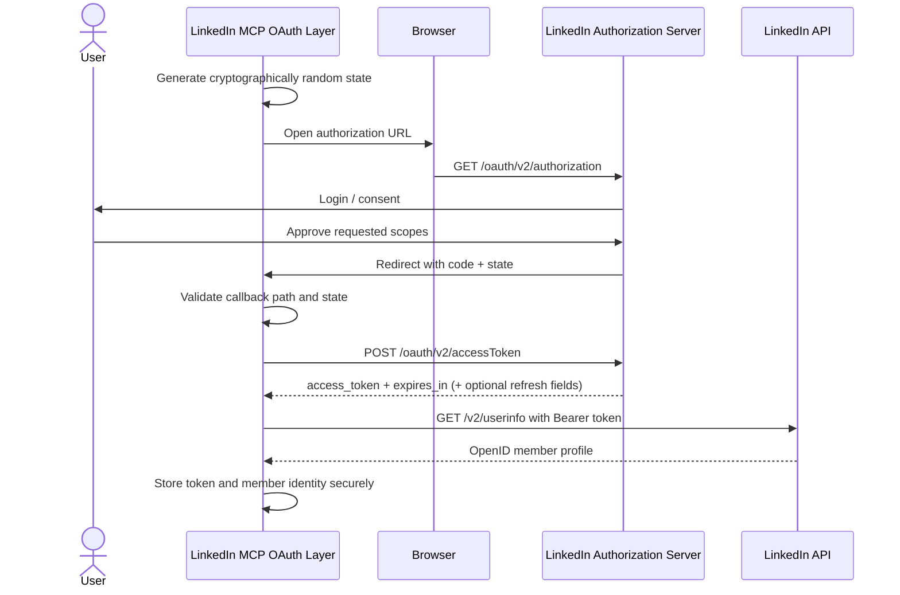

# LinkedIn OAuth Flow

This document defines the OAuth design for the LinkedIn MCP Server before the production authentication implementation is completed.

## Goals

The OAuth layer must:

- authenticate a LinkedIn member through LinkedIn's 3-legged OAuth authorization-code flow;
- obtain only the permissions required by the MCP tools;
- protect the authorization callback against CSRF;
- keep client secrets, authorization codes, access tokens, and refresh tokens out of logs and Git;
- support a simple local-development callback and a production HTTPS callback;
- fail safely when consent is denied, the callback is invalid, or a token becomes unusable.

## Required LinkedIn products and scopes

The current MCP server needs two LinkedIn capabilities:

| Capability | LinkedIn product | Scope | Required |
| --- | --- | --- | --- |
| Identify the authenticated member | Sign In with LinkedIn using OpenID Connect | `openid` | Yes |
| Read the member's lite OpenID profile | Sign In with LinkedIn using OpenID Connect | `profile` | Yes |
| Publish/manage member content | Share on LinkedIn | `w_member_social` | Yes |
| Read member email | Sign In with LinkedIn using OpenID Connect | `email` | No |

The target scope set for this project is therefore:

```text
openid profile w_member_social
```

`email` should not be requested unless a future feature actually needs it. This follows least-privilege design.

> Current gap: the existing root-level `linkedin_oauth.py` helper requests only `w_member_social`. It is a local proof of concept, not the final OAuth implementation.

## Authorization flow



## Authorization request

The browser is redirected to:

```text
https://www.linkedin.com/oauth/v2/authorization
```

Required parameters:

- `response_type=code`
- `client_id=<LINKEDIN_CLIENT_ID>`
- `redirect_uri=<exact registered redirect URI>`
- `state=<cryptographically random value>`
- `scope=openid profile w_member_social`

The `state` value is mandatory in this project even though OAuth servers may describe it as optional. It must be generated per authorization attempt, stored only as long as needed, and compared before accepting the returned authorization code.

## Callback validation

The callback handler must reject the request unless all of these checks pass:

1. The callback path is exactly the configured callback path.
2. LinkedIn did not return an OAuth `error` response.
3. The returned `state` exists and exactly matches the pending authorization attempt.
4. An authorization `code` exists.
5. The authorization attempt has not already been consumed.

The authorization code is short-lived and must never be logged in full.

## Token exchange

After callback validation, the server exchanges the authorization code at:

```text
https://www.linkedin.com/oauth/v2/accessToken
```

The token exchange uses the server-side LinkedIn client secret. The client secret must never be sent to an MCP client or exposed in browser-side code.

The implementation should persist at least:

- access token;
- token expiry timestamp derived from `expires_in`;
- granted scopes when returned;
- authenticated member identifier / author URN required by the publishing tools.

LinkedIn access tokens are currently issued with a finite lifetime (commonly 60 days). The application must also handle early invalidation, revocation, scope changes, and `401 Unauthorized` responses by requiring reauthorization.

Programmatic refresh tokens must be treated as optional capability. LinkedIn documents them for approved programs such as Marketing Developer Platform partners; the base MCP server must not assume a refresh token will always be returned.

## Local development flow

Local development may use a loopback callback such as:

```text
http://localhost:8000/callback
```

Flow:

1. Load `LINKEDIN_CLIENT_ID` and `LINKEDIN_CLIENT_SECRET` from local environment/secret storage.
2. Generate a fresh state value.
3. Open the LinkedIn authorization URL in the user's browser.
4. Start a loopback HTTP callback server bound only to localhost.
5. Validate the callback.
6. Exchange the code for a token.
7. Retrieve the OpenID profile.
8. Store credentials using the local credential provider.
9. Stop the temporary callback server.

Local credential files must remain ignored by Git and should use restrictive filesystem permissions.

## Production flow

Production must not reuse the local callback server design.

Production requirements:

- use an HTTPS callback URL registered exactly in the LinkedIn Developer Portal;
- keep the client secret in a production secret store/environment, never in source control;
- associate each OAuth state value with the initiating session/request;
- expire pending state values quickly and make them single-use;
- perform the code exchange only on the server;
- persist tokens through the credential-provider abstraction rather than direct ad-hoc file writes;
- redact secrets from structured logs and error payloads;
- return only safe OAuth status information to MCP clients.

Example production callback:

```text
https://example.com/oauth/linkedin/callback
```

## Failure states

| Failure | Expected behavior |
| --- | --- |
| User denies login/consent | Return a safe authorization-denied result; do not exchange a token |
| Missing or mismatched `state` | Reject callback immediately |
| Missing authorization code | Reject callback |
| Callback URI mismatch | Fail authorization and surface configuration error |
| Token exchange returns 4xx | Return sanitized OAuth error; never expose client secret/code |
| Token exchange times out / network fails | Return retryable network error without leaking credentials |
| LinkedIn API returns 401 later | Mark credential unusable and require reauthorization |
| Required scope missing | Refuse dependent MCP operation with a permission/configuration error |
| Token revoked or expired | Require reauthorization |

## Security requirements

- Use a cryptographically secure random `state` value for every OAuth attempt.
- Never print or return full authorization codes, access tokens, refresh tokens, or client secrets.
- Never put secrets in query parameters other than values required by the OAuth authorization request.
- Keep the client secret on the server side only.
- Use exact redirect-URI matching and HTTPS in production.
- Request the minimum required scopes.
- Treat tokens as credentials with restrictive storage permissions.
- Redact credentials from exceptions, HTTP diagnostics, and MCP tool errors.
- Do not persist OAuth state longer than the authorization attempt requires.
- Do not assume token validity solely from the stored expiry time; handle revocation and LinkedIn `401` responses.

## Implementation boundaries

This issue defines the design only. Follow-up implementation work belongs to:

- **#13** — Implement OAuth authorization callback and token exchange.
- **#14** — Implement secure token storage abstraction.

The existing `linkedin_oauth.py` helper can be reused as a reference, but production OAuth logic should live in the application package and follow the response/error conventions used by the MCP server.
